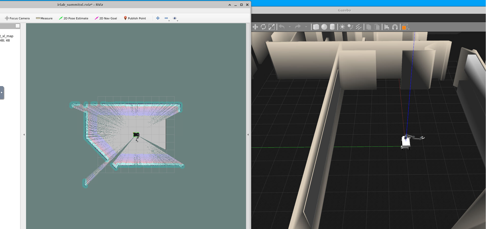

# SAR using ICC LAB - Summit_XL

This repository showcases the implementation of various operations, including obstacle avoidance, map generation, and search and rescue in an unfamiliar environment using a ground robot.

# Installation and Dependancies

1. [Ground Robot Setup - Summit XL Container](https://github.com/icclab/rosdocked-irlab)

To run the robot navigation :

	roslaunch icclab_summit_xl irlab_sim_summit_xls_complete.launch
  
  Arguments to irlab_sim_summit_xls_complete.launch:

        <!-- GAZEBO -->
        <arg name="ros_planar_move_plugin" default="true"/> <!-- disables gazebo ros_control plugin -->
        <arg name="gazebo_world" default="$(find icclab_summit_xl)/worlds/summit_xl_office.world"/>
        <arg name="gazebo_gui" default="true"/>

        <!-- NAV STACK PARAMS -->
        <arg name="launch_rviz_nav" default="true"/>
        <arg name="map_file_a" default="willow_garage/willow_garage.yaml"/>
        <arg name="localization_robot_a" default="false"/>
        <arg name="gmapping_robot_a" default="false"/>
        <arg name="move_base_robot_a" default="true"/>
        <arg name="amcl_and_mapserver_a" default="true"/>
        <arg name="slam" default="false"/>
	
 The launch command:
 
  	roslaunch icclab_summit_xl irlab_sim_summit_xls_complete.launch gmapping_robot_a:=True 
By running the launch file, the ground robot equipped with gmapping SLAM will be initialized. As the robot is navigated through the environment, the map will be automatically generated using laser scan data
  
 
 
2. [OpenCV](https://github.com/opencv/opencv-python)

3. [Yolo V8](https://github.com/ultralytics/ultralytics)
  
# Different Nodes and their functionality

1. [Obstacle Avoidance](SimpleObstacleAvoidance.py) 
: This node implements a simple obstacle avoidance sequence using the lidar scan data and a threshold distance value
2. [Obstacle Avoidance with Position Tracking](ObstacleAvoidance_PositionTrack.py)
: This node implements a obstacle avoidance sequence with position tracking to avoid visiting a location more than ones
3. [Map Generation Using Move Base Client](MapBuilder.py)
: The node activates a Move Base client with a random goal generator
4. [Move Base Client with Map Boundaries as Goal](MapBuilder_Final.py)
: The node activates a Move Base client with existing map boundaries as next goal values
5. [ Object Detection](detection.py)
: The node implements a YOLO V8 model for object detection in the environment

# Final Presentation
[FInal Technical Presentation](https://github.com/2ashishmohan/SAR_ICCLab/blob/main/SAR_Presentation.pdf)
